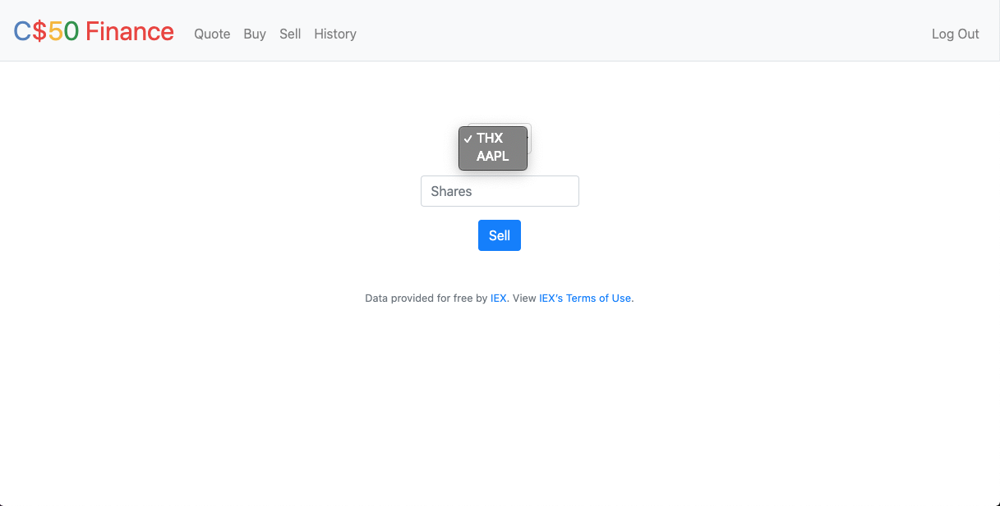

# **Stock Trading Website**

# Description
A web application with a frontend and a backend. Made using Python, Flask, SQLite, HTML, CSS, JavaScript, and Bootstrap.

Through this app, I can register as a user, get information about real-time stocks according to a stocks API, [IEX](https://iexcloud.io/), then buy and sell those stocks. Through the app, I can view a portfolio of my owned stocks and a history of my transactions. 

This project was part two of [Harvard CS50's Web Development Track](https://cs50.harvard.edu/x/2020/tracks/web/) (as opposed to various other tracks, such as Game or Mobile App Development). Part one was to build a series of static web pages using Vanilla JavaScript, HTML, and CSS.

[Click here to watch a video demo of this app.](https://www.youtube.com/watch?v=Ipbgx6DzD6w)

Pictures of the application are below. Click them for larger versions.

#

# Project Files
The following links contain summary overviews of each file used in the project. Please refer to a file's code directly for specific implementation and details regarding that file.

* [application.py](#applicationpy)
* [helpers.py](#helperspy)
* [finance.db](#financedb)
* [styles.css](#stylescss)
* [apology.html](#apologyhtml)
* [buy.html](#buyhtml)
* [finance_index.html](#finance_indexhtml)
* [history.html](#historyhtml)
* [layout.html](#layouthtml)
* [login.html](#loginhtml)
* [quote.html](#quotehtml)
* [quoted.html](#quotedhtml)
* [register.html](#registerhtml)
* [sell.html](#sellhtml)
* [requirements.txt](#requirementstxt)

## application.py
This is the main application file that our web framework, Flask, will run from. We too use this file to interact with our
HTML files via Jinja. We also use it to program our user SQL database. It contains all of the backend, SQLite database code,
a helper function, and the `GET` and `POST` functionality behind our HTML.

## helpers.py
This is a helper file to `application.py`. It assists the CS50 distribution code used within `application.py`. All functions in
this file are required for the application to run.

## finance.db
This is the database that stores our user information. We can read from and write to it via `application.py` when a user wants
to log in or register.

## styles.css
This styles the HTML.

## apology.html
Provides an apology image (a grumpy cat, actually) with a customized error message to a user in case something goes wrong.

## buy.html
Provides a form that allows a user to buy stocks.

## finance_index.html
Shows all of the currently logged in user's owned stocks and their information.

## history.html
Displays a user's transaction history to a logged-in user.

## layout.html
Layout for the site's look and feel.

## login.html
Login page for registered users.

## quote.html
The user submits requests for real-time stock prices here.

## quoted.html
This displays a real-time price for a stock to a user.

## register.html
User registration page.

## sell.html
A page where a user can sell stocks. Provides a dropdown menu of stocks owned by the user.

## requirements.txt
A file that specifies what packages are necessary to run the application.

# License & Copyright
© Alex Guidace

Licensed under the [MIT License](License).
